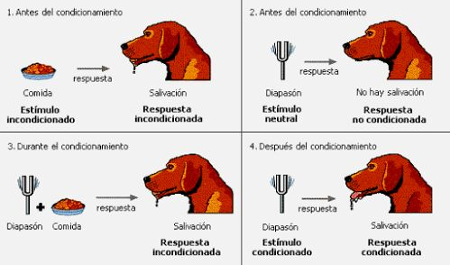
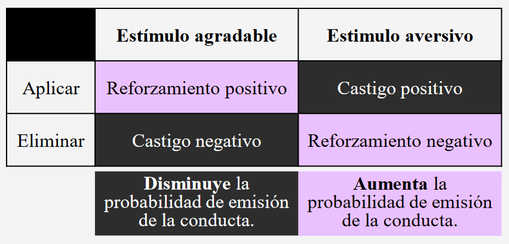

# Tema 5: Enseñar y aprender
Diferentes modelos psicológicos de enseñanza y aprendizaje.

## Bibliografía
3 capítulos del manual prados ppales modelos

## 5.1. Ensñar-aprender dos caras de la misma moneda
- Enseñar es transmitir conocimientos. Desde una perspectiva muy formal.
- Aprender es adquirir onocimientos, no tiene por qué ser en la universidad. Desde que nacemos vamos asociando conceptos.
- Educación: Prácticas sociales mediante las cuales los grupos humanos promueven el desarrollo y la socialización, facilitando los aprendizajes necesarios para convertir a los y las jóvenes en miembros de su cultura. Es un mecanismo de herencia cultural. La educación escolar es una:
    - práctica social, ya que es una actividad socialmente regulada y organizada. Los objetivos y prácticas escolares reflejan las normas y cultura mayoritarias en la sociedad.
    - práctica socializadora. Asegura que los menores de una sociedad aprendan los saberes que esa sociedad considera importante. Los contenidos escolares son el resultado de una selección. 
- La escuela vista como un ascensor social.
- Aprendizaje implícito: Si estuviesemos en el monte y nos intoxicamos, ya aprendemos.
    - Sin acción educativa intencional
    - Sin esfuerzo aparente
    - En cualquier momento y lugar
    - Procesos: observación, imitación, repetición, escucha.
- Aprendizaje voluntario: La eduación vial requiere mayor intencionalidad. 
    - Acción educativa intencional
    - Requiere esfuerzo y disposición favorable.
    - Requiere agente educativo.

## 5.2. El conductismo
- El aprendizaje como asociaciones entre estímulos y respuestas.
- El aprendizaje entendido como cambios en la conducta de las personas en respuesta al ambiente
- Visión pasiva del alumno
- Se centran únicamente en los elementos observables del proceso de aprendizaje.
- Dos grandes modelos:

    ### Pavlov perro y campana (Condicionamiento clásico)
    - Mecanismo de aprendizaje por el que un estímulo neutro (bocina) se asocia con un estímulo incondicionado (comida) yadquiere la capacidad de provocar una respuesta similar incondicionada (salivar).
    
    - Generalización el perro sigue salibando con la bocina (tansferencia de conocimientos)
    - Discriminación saliva con luz, entonces solo con ese estimulo genera la respuesta
    - Extinción: da igual la campana porque no hay saliva, se elimina la relación entre comida y campana.
    - estudio parpadeo: si se le spla, se emite un sonido. Entonces cuando suena la campana, separpadea.

    ### Skinner (Condicionamiento operante)
    - Añade cuestiones culturales en como se establecen las relaciones
    - El condicionamiento operante o instrumental defiende que las consecuencias que siguen a una conducta provocan cambios en la probabilidad de que dicha conducta vuelva a ocurrir.
    
    - Establece que hya un componente cultural o social. Establece el sistema de cuatro elementos: aplicando reforzadores (para que apaerzcan las conductas) o castigos (para que desaparezcan las conductas). Positivo no significa bueno ni negativo malo, sino que aparece o desaparece.
    - Si quiero disminuir la probabilidad de emisión de una conducta puedo aplicar un estímulo aversivo o eliminar un estímulo agradable.
    - Si quiero aumentar la probabilidad de emisión de la conducta tengo que aplicar un reforzamiento positivo o eliminar un reforzamiento negativo.
    - Por ejemplo si quiero que los alumnos se callen o bien puedo llevar a cabo un castigo positivo (aplicar un estímulo aversivo) como aumentar la extensión de un trabajo en 5 páginas o un castigo negativo (eliminar un estimulo agradable) como quitar tiempo de recreo.
    - Si quiero que los alumnos permanezcan callados (aumentar la probabilidad de emisión de la conducta) puedo aplicar un reforzamiento positivo (aplicar un estímulo agradable) dándoles un caramelo. O también puedo eliminar un estímulo aversivo (reforzamiento negativo) por ejemplo quitar 5 páginas de extensión de un trabajo.
    - Más ejemplos: si fluye la sesion, ref positivo: q buenos sois.
    castigo positivo: q malos sois en el maes (aparece algo desagradable)
    ref neg (para q os sigais comportando asi, quita una lectura del examen)
    si nos quita algo agradable (castigo negativo: nos quita tiempo libre) 

### Implicaciones para el ámbito educativo.
Técnicas de modificación de conducta. Objetivo: incremento de conductas adaptativas o reducción/eliminación de conductas no deseadas.

Para concretar en el curriculum:
- economia de fichas. sistema de puntuacion para reforzar conductas que quiero que aparezcan. concretar al maximo las conductas. los puntos se podrian cangear en la tutoria vemos una peli o hacemos alguna actividad. Portarse bien es ambigüo, hay que ser más concreto.

- contrato conductual: genera un compromiso.

- extincion: se deja de aplicar el reforzador social. Intentar a un chico que molesta en clase. No paras de molestar, al despacho y asi no aplico la conducta. Ya que el estímulo utlizado como castigo puede convertirse en reforzante.

- refuerzo de conducta incompatible: si hablan mucho, decir muchas gracias, os portais muy bien. Si quiero que dejen de hablar, refuerzo el silencio. Si nunca hace los deberes, y est vez si --> ref positivo.

no vale reforzar de cualquier forma, sino tb elegir el momento. no es lo mismo decirlo siempre que elegir el momento y dar un caramelo.

- inmediatez: si el alumno hace ruido y a la media hora callate. que sentido tiene? no se establece la relacion. los reforzadores deben ser inmediatos. siempre que se permita

- proporcionalidad: el profesor castiga 20 minutos a las 2 y media porque 2 hablaban, es excesivo. 

- información: establecer que cosas son las que no estan permitidas. y que tenga sentido para el alumno para que sirva de algo.

- refuerzo como vía más efectiva que el castigo: entre aplicar reforzadores y castigos: los castigos sirven a corto plazo. los reforzzadors permiten q las (consolidarlas) conductas perduren mas en el tiempo.

## 5.3. El cognitivismo
- El aprendizaje como construcción cognitiva que hace el aprendiz.
- le damos prota al aprendiz
- este modelo se centra en como el sujeto esta procesando la informacion que sucede al rededor y en como la gestiona.

- aprendizaje vicario: aprendizaje por observacion pero no solo eso.

- video bandura(como observando cosas aprendemos las mismas) el niño replica las conductas, esta bien pegar al muñeco de la misma forma que el adulto. el niño coge una pistola y amenaza al muñeco y eso el adulto no lo habia hecho.

- no hay solo observación, porque el también elabora y hace una generalización del aprendizaje.

- La observación no es suficiente, es necesario que tengan lugar estos procesos congnitivos para que se de el aprendizaje: 
    - prestar atencion
    - memorizar 
    - repetir
    - motivacion social. si el adulto lo castiga, el nivel de motivacion reducira. campañas contra el tabaquismo: profe dice que vida sana y luego el profe se fuma un cigarro: incongruencia. por lo que debe haber congruencia para que haya motivación.
(ej pin parental: sexualidad libre cada persona debe gestionar biografia sexual. despues en tu casa: tu padre el virus del mono. incongruencia si el insti te dicen libertad afectivo sexual y en tu casa insultan al colectivo lgtbi).
(bonifacio ej bullying homofobico: se analiza los contenidos de los insultos, la figura del profesor es muy relevant, si no lo cortas, lo estas validando socialmente, esto es cosa de chavales! como profesor puedes participar de frma activa, dice que no lo llama por su nuevo nombre, esta de forma activa que legitima que ocurra la violencia)

## 5.4. El constructivismo cognitivo
- El aprendizaje como un proceso cognitivo donde es importante comprender los procesos mentales implicados que lo permiten.
- el sujeto es activo.
- esos conocimientos que vamos adquidiriando se relacionan con las ideas previas.
- piaget (ya lo vimos en estadios o etapas del desarrollo congnitivo (sensomotor, operaciones formales))
    - esquemas (capacidad para relacionarnos con el entorno). si todo va bien se produce el conflicto (ideas previas contra las q adquirimos). hay dos meacansmo de aprendizaje: asimilar (intrepetrarlo con mis ideas previas, nos mantenemos en el esqumea) acomodar (modificacion del esquema)
    (ej antivacuna, tierraplana si yo se q las vacunas te meten un microchip y si cojo asimilacion aunque se haya demostrado la efectividad en 95%, me da igual para mi las vacunas matas. Acomodar: yo sabian que matan, pero como veo los datos, entonces empiezo a abrir la mente y cambiar de opinion)

    todo esto planteado en apredzaje global (se aprende simpre)
- ausubel y novak (en el ejercicio del aprendizaje formal, no global). los tipos de aprendizaje se guia por dos ejes
1. dim repetitivo-significativo: relacion que establece el aprendiz entre las ideas previas y los nuevos conocimientos. 
    - aprendizaje repetitivo: asociaciones arbitrarias entre los conoc previos y la info a aprender.
    - aprendizaje significativo: relaciones sustantivas entre los conocimientos previos y los nuevos. si se enlazan con las ideas previas. id contrastando con las ideas previas e ir modificandolas. en historia: como creemos que se sobrevivio en atapuerca. ¿como sobrevivir ahora? y a partir de ahi explicar como lo hicieron en atapuerca.

- dimension recepcion descubrimiento (como presentamos la informacion)
1. recepcion: se presenta al alumnado ya acabado
2. descubrimiento: dar el material y elaborar un trabajo. el alumno tiene que descubrir o elaborar el contenido.

de la combinacion de los dos ejes, resultan 4 tipos de aprendizaje.uni: sig por recepcion (RELEVANCIA DE ESTE TIPO DE APRENDIZAJE, es la principal fuente de conocimientos)

parace que todo debe ser por descubrumiento, pero hay estudios q dicen q sig por recepcion hace que uno asimile mejor las cosas. afunmet (repetitivo por descubrimiento). pero ocurre que que se convierten en repetitivo por descubrimiento (test autoescuela). significativo por recepcion esta bien para llegar a las esquemas previos y cambiarlos. repetitivo por descubrimiento: no cambia los esuqemas simplemente vamos probando el software de regresion a ver como funciona.

condiciones para que se produzca un aprendizje significativo: hay que tener en cuenta las ganas y las ideas previas. significatividad logica: hablamos de la adolescencia y como se aprende (coherencia del contenido 2 bloques diferenciados). ninguna de las condiciones resulta suficiente por si sola.

esquema de clase
- recapitulacion
- indice de la clase
- intarcalar exposicion con actividades
- role play
- secuenciacion: cuanto mas programacion, mas claro queda todo, mas facil es el proceso de aprendizaje, sabes enfocar las dudas.
- evaluacion: a la hora de evaluar, tenemos q decidir que evaluamos, que cae lo q se estudio o q tengas mucha experiencia haciendo examenes tipo test. Incluir cosass del proceso de aprendizaje: diario, portfolio, entrevistas,... para que no solo cuente si tuviste un mal dia
- ideas previas(vision sobre un tema, compactada, fundamentada en vivencias anteriores,): te ayuda a modular el discursos. muchas de las ideas previas resisten al cambio. he hecho el exame y no se q me han preguntado. esto puede ser frustante como docente. nuestro alcance esta hasta donde llega.

## 5.5. El constructivismo social
- El aprendizaje como construcción cognitiva que hace el aprendiz en su interacción con otros.
- zona de desarrollo (zona de confort)
- ademas de todo lo anterior, tb nos enfocasmo en el contextot social
- vygotski: importancia de la cultura
habla de dos dims d eaprendizaje (plano social dondestamos exp a exc de aprend con persoas q nos pautan como aprender y plano intrapsicogloico integracionnde loas conocimientos). los conceptos se contruyen socialmente y aprendemos de forma social. todos tienen un papel ativo
- ZDP: espacio entre los con previos y todo lo q puedo llegar a aprender. todo lo q puedo aprender tiene eq ver con las personas q dan las instrucciones.
- tiene en cuenta todo lo que rodea al aprendiz.

brumer amplia el modelo y habla sobre los andamiajes: como el autor establece elementos hasta q el aprendiz se vuelve autonomo. como poner ayudas para que estas personas aprendan por si solas.

el instructor o el referente para que el aprendiz

---
se le da mucha importancia a los espacios dialogicos entre los aprendices y los expertos.

## 5.6. Concepción constructivista del proceso d eenseñanza-aprendizaje
El tutor pone ejemplos sobre como deben ser los enunciados. con ayudas de tipo visual. que se den instruciones pero fomentando cada vez mas la autonomia.

ZPD: cuanto puede llegar a aprender el aprendiz, 
andamiaje: herramientas del profesor y fomentando la autonomía y la responsabilidad
intersubjetividad: espacio comun donde se construyen significados conjuntamente.

ideas previas vs conocimiento cientifico (hay prejuicios sobre la adolescencia? las ideas previas se adecuan al 
conocimiento cientifico o no)

IMPORTANTE
¿Pq es importante contar con las ideas previas? para autorregular tu trabajo como docente. para ver cuanto domina el tema. gener esp de dialogo: los laumnos expican con sus palabras y les hace integrar mejorar las ideas. conflicto cognitivo (piaget)

## 5.7. El discurso en el aula como herramienta educativa fundamental 
Los tecnicismos se introducen a posterior despues de explicar los conceptos. 4 tipos de preguntas que pueden intercalarse en el discurso. Dos tipos de habla en el alumnado: exploratoria y final. obtencion mediante pistas (gestos de aproximacion). sistema olfativo: nariz para dar la pista. categorizar las relaciones: confirmaciones, reformulaciones y elaboraciones (lo que comentas es interesante pero vamos a darle una vuelta)