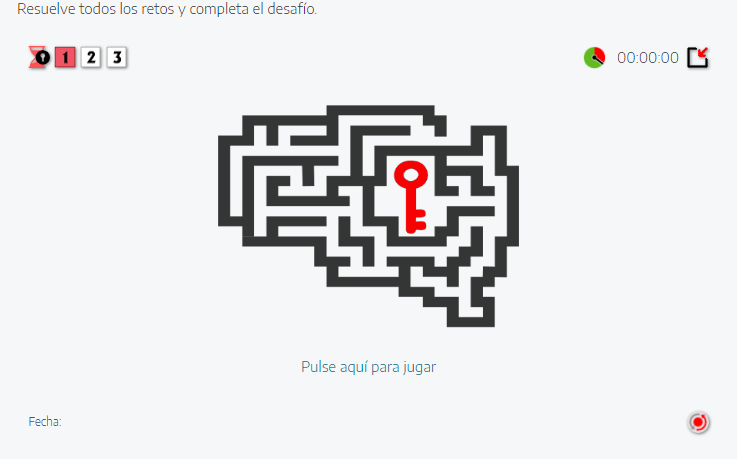

Entrega trabajo 12 enero. En el proyecto de exeLearning tenemos que incluir geogebra: o bien hecho por nosotros o un recurso a hecho. Si cogemos uno hecho, tenemos que hacer otro a parte de Geogebra aunque no tenga nada que ver. la actividad de geogebra hay que subirla a la nube para poder utilizarla en eXeLearning

creative commons - es como libre pero ese concepto solo se usa para LaTeX.

Si queremos imágenes libres: respositorio imágenes creative commons
Sitios interesantes que no suelen aparecer en Google: 
- intef --> recursos educativos --> bancos de imágenes y sonidos --> Usamos el buscador para encauzar el tema que buscamos
Es más útil para audios, por ejemplo sonido ambiente de un campo de fútbol
- Mediateca (comunidad de madrid)
- wikimedia (joya de la corona) todo es abierto, sobre todo para física, biología,...
- desde google --> imágenes --> herramientas --> Licencias de uso --> Creative commons
- Youtube --> fútbol --> filtros --> Característicaas --> Creative commons. La mayoría de vídeos no lo se. Google --> Terminos de uso youtube --> Permisos y restricciones --> Lo podemos usar para uso no comercial, si para uso personal, no lo puedes usar para clases. Pero sí desde el reproductor youtube. exeLearning te facilita esta tarea: exeLearning --> Actividades interactivas --> Vídeo interactivo --> Youtube --> pongo la url --> tick. Ya me aparece como reproductor youtube.

------
Cedec, buscamos algún recurso que tenga un vídeo interactivo. Vemos que el vídeo de repente se para y aparece un cuadro de texto. En exeLearning tú no puedes recibir directamente las respuestas de los alumnos. Tendría que ser mediante una platarforma a parte, pero es muy limitado, con los vídeos interactivos no se puede hacer.

-----
Abrimos exeLearning con el ejecutable exelearning.exe
Actividades interactivas --> Vídeo interactivo
Mostrar puntuación es para las actividades de tipo test. Para ver los fotogramas en momentos puntuales del vídeo, abrimos el editor.
Le damos al vídeo, lo paro donde quiero y le doy al símbolo +, crear fotograma.

Hasta que no pulsemos en el botón de guardar en la esquina superior derecha, no se va a guardar. 

-----
# Juegos
## Adivina
La palabra/expresión es la solución
Definición es lo que va a ver el alumno
Hay un tiempo para contestar, si te pasas, no obtendrás puntos
## Candado
Donde metes el código para ver la información secreta. El código lo debemos haber conseguido de otra manera. El código podría ser la solución a una ecuación.
Lo que se muestra al alumno es la retroalimentación, una vez ha introducido el código. La gracia es que esto tiene un tiempo límite.
## Mapa
Es una imagen con zonas interactivas. 
## QuExt
Quién quiere ser millonario
## Rosco
Barrita interactiva $\vdash$
- Si la parte de la roja se encuentra en la izquierda, es que la palabra debe empezar por la letra correspondiente
- Si la parte roja se encuentra a la derecha, es que la palabra debe contener la letra.
## Desafío
Un desafío está compuesto por varios retos

Tenemos un temportizar de cuenta atrás que previamente

---
# LaTeX en exeLearning
Google --> Usar LaTeX en exeLearning --> https://latex.bilateria.org --> exeLearning -->  Motor MathJax en eXe --> Copiar el código.

eXe --> Marcar modo Avanzado en eXe.
Luego Propiedades --> Opciones avanzadas --> personalizar la sección HEAD --> pegar el código --> Guardar 

Problema 1: no se puede previsualizar las fórmulas sin darle a guardar

Problema 2: No funciona laTex en las actividades

------
# Moodle (enseñanza virtual abierta)
eXe --> actividades intereactivas --> Cuestionario SCORM
Tambíen permite un juego QuExt para subir a SCORM
Para implementarlo en Moodle, buscar la documentación correspondiente.
