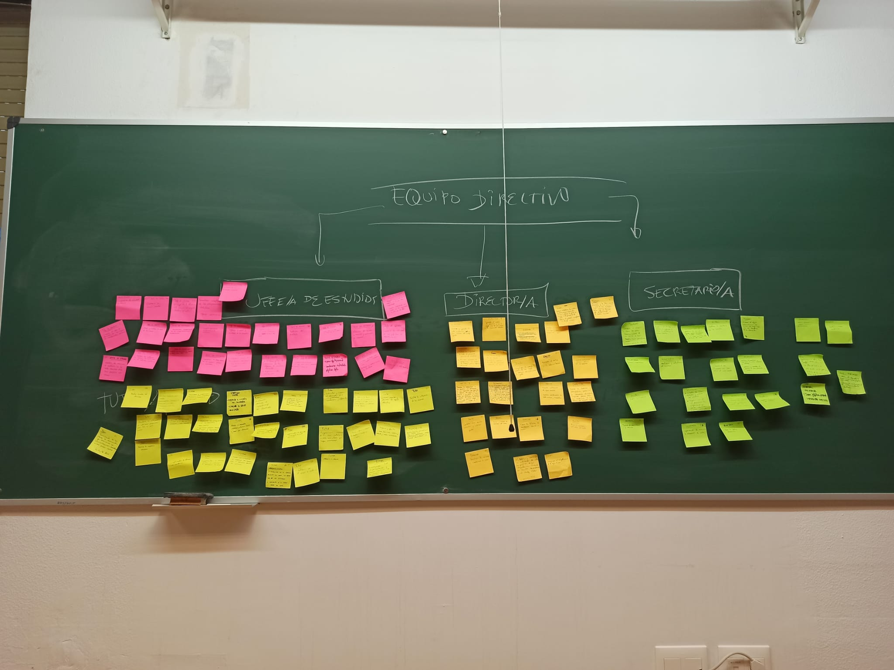
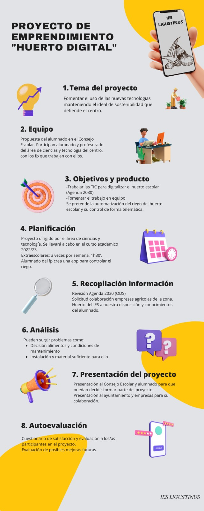
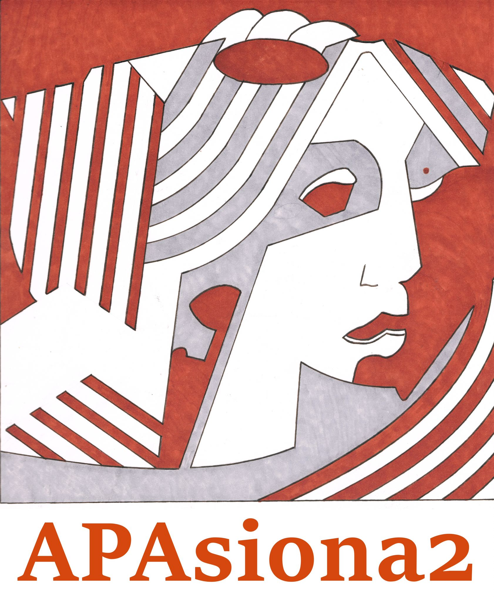
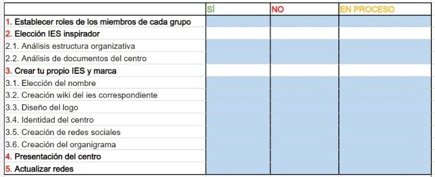

# 27 de octubre: Fantasía.
Mi segundo día de clase comenzaba a las 4 de la tarde con la asignatura de Procesos y Contextos Educativos. Yo llegaba un par de minutos tarde, aún sin haberme acostumbrado al laberinto en el que me había visto inmersa el día anterior: el Centro Internacional de Posgrado o la Escuela Internacional de Posgrado. Nombres distintos pero, ¿una misma realidad? Espero resolver este misterio antes de que termine el Máster.

Entré en el aula 1.10 algo apurada pensando que la clase habría empezado pero la profesora aún no había llegado. Me dispuse a sacar mi "taquito" de folios como bien acostumbré en el Grado de Matemáticas y varios bolígrafos. La historia de porqué no tengo estuche la reservaré para más adelante.

Entonces cruzó la puerta María Dolores Díaz Noguera, a la vez que nos preguntaba si eran suficientes los 5 minutos de cortesía para dar comienzo a la clase. Inmediatamente a continuación, se acerco hacia mi e hizo amago de coger algo que se situaría en mi mesa. Cogió entonces un folio de los de mi "taquito" y lo arrugó hasta convertirlo en una pelota. Después aclaró que era Lola como le llamaban.

Era el día de la Presentación de la asignatura y como su propió nombre indica, comenzaron las presentaciones, donde la pelota tomó el papel de rompedora del hielo. Lola la lanzó aleatoriamente a uno de nosotros y así fuimos diciendo nuestro nombre, especialidad en la que nos habámos matriculado (en mi caso Matemáticas) y el motivo por el cual habíamos optado por estudiar el MAES. El grupo más númeroso dentro del aula es el de los ingenieros, seguidos por los filólogos. Esa tarea nos ocupó la primera hora de la sesión.

En la segunda hora, Lola nos explicó cómo iba a desarrollarse la asignatura y los aspectos generales de la misma, así como estaba orgnizada la evaluación. Como punto número 1, nos planteo la primera cuestión que para nada trivial:

¿Queremos ser estudiantes asintentes o no asistentes?

Aún denominándose esta clase "estudiantes asistentes", se les permitiría un 20% de faltas, que se traducen a dos días de ausencia. Esto se debe a que el número total de sesiones que componen la asignatura son 10.

Las sesiones se estructuran de la siguiente forma:
- Sesión 1: La presentación.
- Sesión 2: formación de grupos y explicación de roles del Reto 1.
- Sesión 3: Reto 1.
- Sesión 4: Reto 2.
- Sesión 5: Reto 2.
- Sesión 6: Reto 3.
- Sesión 7: Reto 3.
- Sesión 8: Reto 4.
- Sesión 9: Reto 4.
- Sesión 10: Juego final.

Cada uno de los cuatro retos irá enfocado en conseguir los objetivos de cada uno de los siguientes cuatro bloques de contenido:
- Reto 1: Sistema educativo.
- Reto 2: Organización
- Reto 3: Aula
- Reto 4: Papel del profesor en el aula.

Cada uno de estos cuatro retos estarán basados en una metodología activa, donde abordaremos los contenidos de cada bloque grupalmente.

### Evaluación
La evaluación de estos trabajos en grupos supondrá un 60% de la nota final, es decir, 6 puntos, con 3 de ellos la Wiki estará aprobada.

Los otros 4 puntos de la nota final, dependerán única y exclusivamente de uno mismo, del trabajo personal. 2 de esos 4 puntos, se evaluarán por la redacción de un Diario de Aprendizaje o por un desarrollo de alguno de los hilos propuestos al final de cada reto.

Es obligatoria la elección de uno de los trabajos individualmente propuestos. En mi caso me decanté por la elaboración del diario como podréis comprobar.

Los otros 2 puntos restantes serán opcionales, y se evaluarán mediante posibles trabajos trabajos propuesto al final de cada reto o competiciones. Estos dos puntos podrán ayudarnos a conseguir la excelencia académica.

¿Cómo se aprueba la asignatura? Aprobando la Wiki y obteniendo al menos 1 punto de los 2 obligatorios por la realización del Diario de Aprendizaje. Si se obtiene un 3 en la Wiki, pero menos de un 1 en el Diario o hilo, Lola se enfará.

### Diario
En él debemos introducir si se han alcanzado y de que manera los objectivos marcados para la sesión. Dichos objetivos se publicarán en la [enseñanza virtual](https://ev.us.es/) en la página de la asignatura.

También debemos dar nuestra visión sobre lo acontecido durante la sesión, apoyándonos en recursos audiovisuales, como fotos que podamos tomar durante el día.

### Metodología
Las bases de la metodología serán la gamificación la cual llevaremos a cabo con la ayuda de recursos, tanto analógicos como digitales. Para estos segundos será imprescindible llevar al aula el portátil. Para los recursos analógicos, Lola nos pedirá el día que sea necesario, llevar tijeras y demás útiles.

A las 17.50pm Lola se despedía hasta la semana siguiente porque el martes 1 de noviembre no nos veríamos.

# 3 de noviembre: Sinusitis.
Hoy el día no empezó de a mejor manera. Después de una larga noche de imsomnio por la fuerte tos y dolores por todo el cuerpo, me dispuse a hacerme una prueba de antigenos. Entonces confirmé lo que sospechaba: covid. Sentí impotencia de t

Este capítulo englobará para mi algo más que las 2 horas de la sesión del 3 de noviembre.

Miercoles: llegue fatal despues de clase.

Jueves intente alargar hasta que decidi no ir (correo)

Mi compañera Sandra la mejor, hizo de portavoz y pregunto que ocurria con los rezag(desgraci)ados que no habian podido ir el dia de la formacion de los grupos. me transmitio tranquilidad la que luego reafirmo lola al responderme ese correo.

# objetivos de la sesion

#### Primera parte de la clase
- Pulgar: sostén, dedo de la evolución. ¿En qué somos buenos?
- Índice: dedo relacionado con las metas, nuestra visión de
vida. ¿Cuál es nuestra meta?
- Corazón: conexo a las emociones. ¿Con qué emoción nos relacionamos?
- Anular: relativo a nuestras redes. ¿Cuáles con nuestras redes?
- Meñique: dedo referente a las preocupaciones. ¿En qué te
consideras perfeccionista?

Adjuntar aquí mi mano

#### Segunda parte de la clase
Los roles para los equipos son los siguientes:
Obligatorios:
- Director
- Jefe de estudios
- Secretario
- Administrador
- Explorador: vigilando lo que ponen los demas grupos
- Estrella: lleva la voz cantante del grupo

Roles para rellenar cuando los grupos son de más de 6:
- Analista
- Facilitador

Las funciones de cada uno de ellos están en esta web:
https://www.lindacastaneda.com/es/mushware/rolesenclase/

salvo del director, jefe de estudios y secretario, que lo comentará el
próximo día.

Queda pendiente elegir el insituto. Yo ya me encontraré con el IES elegido por no tener grupo aún. También voté por el nombre de la cuenta de instagram. Mi preferido es APAsiona2 debido a mi miedo por las normas APA, las cual desconozco completamente

# 10 de noviembre
- Creación de grupos en la enseñanza.
- Hemos elegido el IES Doñana en el que nos vamos a basar
- IES Ligustinus
- Integración en el grupo de mis compis geniales, analista: rol que quedaó libre
- El analista
Evalúa -con arreglo a una rúbrica básica- el desempeño de cada uno de sus compañeros. Además lidera la reflexión de aprendizaje del grupo. Suele tener algunas pistas de qué reflexión le pedimos, debe responder a cosas como ¿qué se pretendía en la tarea?,¿qué habéis aprendido?¿qué te va a ser útil en el futuro?¿qué es lo más inútil de la tarea?¿lo más divertido?…. Entre otras varias (a las preguntas de estas reflexiones le hemos dado muchas vueltas, especialmente con el profesor Jordi Adell de la UJI con quien solemos compartir calentamientos de cabeza relativos a nuestras clases, porque son seguramente lo que más echamos en falta, la reflexión de los estudiantes).
- @LolaDaz crear twitter
- Repaso de los roles:
    - Administrador:
        - Repartir las tareas
        - Iniciativa
        - Resolver los conflictos
    - Estrella:
        - Comunicar que se ha hecho durante el día: actuación al final de la sesión
        - Involucrarse en el resto de tareas
    - Explorador/curador:
        - Se encarga de la materia prima
        - Encargados de buscar la documentación necesaria
    - Analista:
        - Buscamos información concreta dentro de toda la documentación.
        - Analizo y valoro que va en el material que el proyecto.
        - Solo selecciona, no lo evalúa.

Líneas de un centro: clases de un mismo curso que existen en un instituto
Ratio de alumnos por aula: 25 en primaria, 30 en secundaria y 35 en bachillerato
Leyes:
    - LOE: 2006
    - LOMCE: 2013
    - LOMLOE: 2021
¿Por qué la LOMCE fue tan controvertida? Después del franquismo, la 1a ley de transicion democratica fue la LOCSE. En el tema del corporativismo era todo muy avanzado: el grupo de profesores tenían autonomía, libertad para decidir. La LOMCE: jerarquía directores y les da mucho poder podéis abrir expedientes disciplinarios a sus compañeros. En la LOE todos se reunían para elegir al director. Por eso la LOMCE fue controvertida.

# 15 de noviembre
## Anuncio de Lola el día

---------
Estimados estudiantes, continuamos con el RETO 1.

1º Las estrellas presentarán a sus IES para ello deberán utilizar una herramienta de presentación. ¿Qué información encontraremos?

1-1 La estructura organizativa del IES (organigrama). ¿Podríamos identificar las claves de funcionamiento de nuestro IES? y ¿Cómo es el Sistema de relaciones?  ¿Cómo lo conseguiremos?...

1-2- Para conocer cómo funciona nuestro IES debemos tener la normativa existente. En nuestro caso necesitaremos: 

 LOE (2006). Ley Orgánica 2/2006, de 3 de mayo, de Educación.

 LEA (2007). Ley 17/2007, de 10 de diciembre, de Educación de Andalucía.

 LOMLOE (2020). Ley Orgánica 3/2020, de 29 de diciembre, por la que se modifica la LOE (2006), de Educación.

 Los curadores deben buscar documentos o material multimedia que ayude a su comprensión. 

1-3- Todos los IES han identificado el organigrama del IES inspirador y lo incluiremos en nuestra wiki para tenerlo como referencia. Además de su marca y aspectos mencionados en el anuncio anterior. No olvidar esto para los administradores. 

1-4- Conoceremos las funciones del Equipo Directivo. La dinámica utilizada será el “Diseño de un mapa conceptual”.

P.D: para las redes no olvidar  mencionarme en Twitter @LolaDaz 

#estructura IES

#organigrama

#funciones del director

#funciones del secretario

#funciones del jefe de estudios

#cómo funcionamos

¡¡¡ADELANTE¡¡¡

---------
Creación de wikis para estrellas, curadores y analistas.
Reto 1 paso 1: está bien estructurada? foto de la wiki? redes? presentacion? web del centro inspirador? pagina web? contexto? diseño de un proyecto emprededor (para ello hay que ampliar el contexto) ubicacion fisico, caracteristicas socioeconomicas. Esos proyectos de innovacion del centro van regidos segun unas leyes. reto 1: oferta emprendedora del ies, algo novedoso que nos haga mejorar.

------
En mitad de la sesión Lola detuvo la dinámica de los grupos para "jugar". Repartió cuatro taquitos de Post-it a los alumnos que nos encontrábamos en primera fila e individualmente, debíamos coger uno de cada color: amarillo, rosa, naranja y verde. Siguiendo la LOMLOE, debíamos escribir en cada Post-it una de las varias funciones que tienen los siguientes miembros del equipo directivo de un centro educativo: secretario, tutor, director, jefe de estudios y por otra parte, el tutor. La relación figura-color se dispuso de la siguiente forma:
- Amarillo: tutor
- Naranja: director
- Rosa: Jefe de estudios
- Verde: secretario

Para dinamizar la puesta en común de las funciones recolectadas por cada uno de nosotros, para cada una de las cuatro personalidades, Lola hizo que formaramos un enorme círculo humano rodeando las bancas. La siguiente imagen es una fiel representación de lo que se vivió en aquellos momentos:

Empezamos a girar tan rápido como nos permitían los distintos cables de los portátiles que estaban enchufados en la pared del aula.

A la voz de alto de la profesora Lola, el alumno que se encontrase a la altura de la tercera silla de la primera banca, comenzando por la derecha, debía coger uno de entre las decenas de papelillos que previamiente Lola había recortado y que se encontraba dentro de una funda de plástico de desconocido dueño.

Cada uno de esos papeles llevaba escrito un número, donde cada uno de ellos se correspondía con uno de nosotros. Yo era el número 3.

Que casualidad que el primer papel seleccionado fue el que llevaba el número 1, el de Lucas.

Él debía decir entonces una de las funciones de la que era responsable el director de un instituto de enseñanza secundaria y a continuación colocar su Post-it en la pizarra.

Así seguimos rotando por la clase hasta que la pizarra tomó el siguiente aspecto

Ya todos en nuestros respectivos asientos fuimos repasando de la mano de nuestro compañero Antonio las distintas funciones según la LOMLOE. Él leyo cada una de las 15 funciones del director, llegando entre todos a la conclusión de que podían resumirse en cuatro funciones fundamentalmente. La más importante de todas ellas es la

    Representación

En este punto surgió el debate de si un director debía representar a la Administración y en cierto modo, controlar a sus compañeros o en caso contrario, ser el representante de sus compañeros.

También repasamos las 10 funciones del jefe de estudios y las 11 del secretario, concluyendo que las funciones de los distintos miembros del equipo directivo quedan muy solapadas con esta nueva ley.

El objetivo de esta dinámica fue el de asimilar al menos una de las funciones de cada una de estas cuatro notabilidades dentro del sistema educativo.

----------
Por último, vimos varias características de uno de los órganos colegiados, el consejo escolar. Este órgano se encarga de al rededor unas 17 funciones, donde destacamos la siguiente:

    "Aprobar y evaluar los proyectos y normas"

 Destacamos esta función ya que en la sesión del próximo día tendremos que elaborar un proyector emprendedor el cual tendrá que ser aprobrado por el consejo escolar.

Algunas de las características que cumple el consejo escolar son:

- El presidente del consejo es el director.
- El secretario elabora el acta de la sesión.
- El secretario tiene voz pero no voto.

--------

# 17 de noviembre
## Anuncio de Lola
Estimados estudiantes, el propósito de esta sesión es diseñar un “Proyecto de innovación” o “Proyecto de Emprendimiento”, existen diferentes opciones, cada IES según sus circunstancias elige el suyo. 

1º El RETO Nº1  se llama: SIENTE- IMAGINA-ACTÚA-EVALUA-COMPARTE

1-1- ¿Por qué este título? La idea es que el profesorado se sienta agente activo y protagonista del cambio, no solo en los procesos de enseñanza y aprendizaje de sus estudiantes, sino también en la transformación de los entornos o contextos donde se situan los IES. 

1-2- ¿Què necesitamos? Una guía…

AQUÍ  la encontramos…

RETO 1- PASO 2

Nuestro IES como espacio idóneo para el diseño, implementación y evaluación de proyectos emprendedores.

1-1-¿Cómo lo hacemos? Empezamos con los siguientes recursos:

IMPORTANTE: LA GUÍA PARA EL EMPRENDIMIENTO

https://www.todofp.es/ca/dam/jcr:d0206a88-51a3-4d0f-8217-7257a4221da1/guia-del-aula-de-emprendimiento-con-isbn-indice-vinculado-y-marcadores.pdf 

VÍDEO: 

https://www.youtube.com/watch?v=MxX5iVhWtus

En cualquier caso, existen unos pasos (ya hemos andando en nuestro itinerario). ¡AVANZAMOS!

1-Entorno- salimos para analizar. En el interior de la web inspiradora.

2- Escribimos nuestras observaciones. 

3- Organizamos ideas para el mapa conceptual. 

4- Decidimos nuestro foco de atención.

5- Por ejemplo, nuestro RETO es “evitar colillas” //Cómo amar a los animales...

No olvidamos que el IES tiene documentos, queremos saber como ha sido su trayectoria en innovación.

#PROYECTO DE DIRECCIÓN. ...

#PROYECTO EDUCATIVO DE CENTRO. ...

#PROYECTO JORNADA CONTINUA.

#PLAN DE ATENCIÓN A LA DIVERSIDAD.

#PLAN DE ACCIÓN TUTORIAL.

#PLAN DE CONVIVENCIA. ...

¿Qué documentos tienen vuestros IES?

¡¡¡¡¡ADELANTE!!!

------

 A eso de la una de la tarde recibimos alguna información complementaria:

 -----

 Estimados estudiantes, alguna información adicional...

1º En contenidos podremos encontrar algunas ideas para el PASO 2 

2º Recomendable la infografia DISEÑOS DE PROYECTOS ABP.

3º Presentación del 1º hilo de trabajo individual

3-1- En la sesión de hoy los IES trabajaran con instagram, también. 

3-2- Primera propuesta formativa de instagran conjunto. 

Nombre apacionados

-Futurosdocentesapasionados

-contraseña: Docen2022!!

En el aula realizo la presentación. 

¡¡¡ADELANTE¡¡¡ 

--------------

Lola comenzó la sesión haciendo un breve repaso al trabajo realizado. Había hecho la correción de la Wiki de las Estrellas, en la cual debía encontrarse la presentación del IES correspondiente. Comentó la importancia del Just-In-Time, base por la que se rige la evaluación continua.

A continuación, se enumeraron las funciones de los roles que iban a tener más peso en el transcurso de la clase:

- Administradores. Debían realizar una síntesis en la Wiki de los enunciados del anuncio que ha mandó por correo electrónico a la vez que elaborar la infografía de ABP (un tipo de metodología activa). Nuestra Administradora Loreto se puso manos a la obra y este fue el resultado:

- Curadores. Búsqueda de material significativo en relación con los hagtags de los anuncios correspondientes a la sesión. Posibles herramientas que pueden utilizarse para esta labor pueden ser: Wikipedia, Google Scholar, Youtube,... Los hagtags son obligatorios pero también los curadores pueden añadir otros que tengan relación con el tema. Este trabajo también debe ser publicado en la wiki del centro.

- Analistas. Elaboración del borrador de items o indicadores de evaluación para la valoracion del Reto 1. Dichos items tendrán que ver con la identificacion de la web inspiradora, caracteristicas de la web, del diseño...

Por tanto, mi misión de llevar a cabo la página web del IES se vio truncada por otras tareas.

Mi clase se dividió en tres partes.

## Primera parte: APAsiona2

Entré en el aula después que Lola. Ese día venía caminando hasta clase con un amigo y todos sabemos como las buenas compañías paralizan el tiempo. Me asaltó Lucas casi en la puerta para decirme que la profesora estaba encantada con el logo que había creado para la cuenta de Instagram común de la clase. Este compañero mio es artista y me gustaría compartir su trabajo con vostros. Podéis ver el resto de su obra en su perfil de instagram.

https://www.instagram.com/lucas_rguez_q/

Para descargar un poco a nuestra Administradora Loreto de la sobrecarga de funciones, opté yo por desempeñar el papel de Community Manager del IES Ligustinus. Mi tarea consistía entonces en actualizar la imagen de perfil de la cuenta de apasionados y crear un post haciendo referencia a la aportación de mi compañero lucas, esto último tanto en la cuenta de apasionados como en la dos de IES Ligustinus (Instagram y Twitter), para que Lola lo evaluase correctamente. Ella suele acceder a Twitter la misma noche en la que tienen lugar nuestras sesiones para así retuitear y llevar así la cuenta del trabajo por evaluación continua. ¿Tarea fácil verdad? 

Introduje el nombre de usuario y contraseña de Instagram de @futurosdocentesapasionados que Lola nos había mandado por correo y perfecto, conseguimos acceder, colocar las fotos y hacer todo lo descrito en el anterior párrafo con respecto a dicha cuenta. Pero algo no nos terminaba de cuadrar a Lucas y a mi. Lola hizo mención a que la cuenta de Instagram tenía una foto "del revés" que nosotros en ningún momento habíamos visto. Aún así estábamos tranquilos con el trabajo realizado porque los datos de dicha cuenta los habíamos recibido en el correo de la profesora.

Avisamos a la profesora para mencionarle lo anterior y efectivamente, existía otra cuenta de Instagram de usuario @apac_ionados con una foto de perfil de la clase al revés y contraseña desconocida. Conseguimos establecer, no sin esfuerzo, una nueva contraseña. El resto de la primera parte de la sesión, nos dedicamos Lucas y yo a deshacer todos los posts, comentarios, tweets y fotos de perfil y a rehacerlos para esta nueva cuenta de Instagram @apac_ionados la cual podéis visitar en el siguiente enlace

https://www.instagram.com/apac_ionados/

## Segunda parte: Analistas

Por primera vez en el Reto 1, tuve que trabajar grupalmente con los analistas del resto de grupos. El grupo de analistas está formado por los siguientes integrantes:

- Fran, de la especialidad de Música
- 
- Esteban, de la especialidad de Matemáticas
- Ana, también de Matemáticas
- Yo, otra Matemática

El objetivo de ese encuentro era llevar a cabo una rúbrica donde recogiesemos los puntos evaluables del reto 1. 

Los matemáticos somos mayoría en este grupo por lo que para la elaboración de la rúbrica optamos por la herramienta de Excel.

Esta plantilla deberá ser seguida en cada uno de los grupos para poder cerciorarse de si cumplen todos los objetivos del reto 1.

## Tercera parte: Intervención de las estrellas
Por falta de tiempo, las presentaciones de las estrellas de la sesión anterior se pospusieron hasta hoy. Dedicamos a ello los últimos 20 minutos, en los cuales tuvieron la palabra las estrellas del IES El Limonero y El IES Tiernitos Galvanizados. Sus actuaciones fueron espectaculares, lo hicieron realmente bien. Nuestro turno llegara en la próxima clase del día 22 de noviembre.

Se da por finalizado el Reto 1.

# 1ª propuesta de hilo:
Ofertar en la red información, imágenes, documentos que inspiren a otros docentes. Pueden ir desde temas relacionados con la violencia hasta temas innovadores. Cómo daríamos formación a docentes como nosotros.

Inspiración del tema del proyecto: 
    ¿Qué diferencian a los seres humanos de los animales?
La capacidad de visualizar algo que no existe. Algo importante que nos haga mejorar. La escuela tiene una misión: cambiar las cosas que no están bien mediante los proyectos. La gran caja que nos dirige a todos. Hay objetivos necesarios en la agenda 20/30: igualdad de género, erradicar la pobreza...

# 22 de noviembre
RETO 2 EN EL AULA
Estimados estudiantes, continuamos nuestro itinerario formativo de la disciplina “Procesos y Contextos”. A veces resulta complicado “comprender” que estamos haciendo y, eso se debe a la inercia de la metodología tradicional, que hemos vivido. Ahora bien, como sabéis soís profesores del siglo XXI,  y es muy importante hacernos la siguiente pregunta: ¿Qué significa educar en el siglo XXI? A lo largo de la historìa educativa de nuestro país hemos sufrido muchas leyes educativas y reformas. En estos momentos, con la LOMLOE nos dirigimos hacía un nuevo curriculum, donde las metodologias activas son fundamentales, donde la programación o diseño ha cambiado (situaciones de aprendizaje, este el quebradero de cabeza de los docentes en este momento) y, fundamental uno de los elementos de los diseños instructivos que varía y es fundamental para vuestro futuro desempeño como buenos profesionales es la evaluación.

El propósito del RETO 2  es ir de la norma al aula. ¿Cómo lo haremos? Pues seguiremos la metodología activa propuesta y jugaremos. El juego planteado se denomina el “Cubo de Pensar”.

CUBO DE PENSAR-UNIDAD DIDÁCTICA. Este material lo podéis encontrar en la presentación y el documento word que se adjuntan en el contenido RETO 2.

¿Qué necesitamos para esta sesión? Cartulina, rotuladores, pegamento y unas tijeras.

Instrucciones: 

1º Esta actividad quedará reflejada en una página de nuestra wiki-IES, denominada RETO 2.
2º La actividad se realiza en clase-grupo. En esta sesión se trataría de diseñar una Unidad Didáctica, con la temática elegida para desarrollar nuestro Proyecto de Emprendimiento.
3º En la siguiente sesión “jugaremos” y obstendremos puntos de forma individual. 

¡¡¡¡ADELANTE¡¡¡

-----------

RETO 1: Sólo está enunciado. No está hecho. Pero sí al menos hay que tener un proyecto. El reto 2 va a desarrollar una parte del proyecto, lo que según la LOMLOE se denomina una situación de aprendizaje. El cubo debería quedar hecho antes de la medianoche para que Lola pueda retuitearlo. Lo más importante es que aparezcan los verbos en cada una de las caras. Los otros puntos pueden aparecer por su código QR. El cubo lo tenemos que traer el próximo día para que juguemos donde nos tocará por sorteo rsponder a una de las preguntas de los verbos del cubo. No solo hacer desde el punto de vista analógico, sino aprender situaciones de aprendizaje, además de la taxonomía de Bloom.
Administradora: reto 2 de la norma al aula (en una nueva página de la wiki)
Curadores: #Situaciones de aprendizaje
           #TaxonomiaBloom
Todo escrito en APA  7ª edición
Analista: redes #situaciones de aprendizaje, elegir una teniendo en cuenta que todos tendremos que participar de manera interdisciplinar. Diseñéis un paisaje de aprendizaje donde todos daremos solución a un problema de manera interdisciplinar. Todo ligado a la motivación del estudiante. Las soluciones vienen dadas por cada una de las disciplinas. De manera individual tenemos que darle una respuesta. Un hilo para poder lograr el 10 en la asignatura sino lo máximo es un 8.

¿Por qué todos los profesores tienen que hacer las situaciones de aprendizaje?